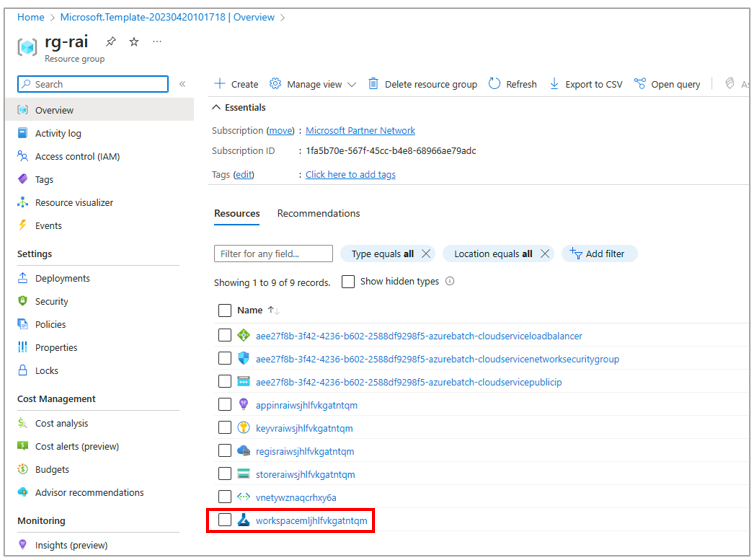
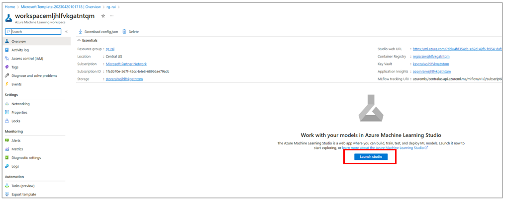
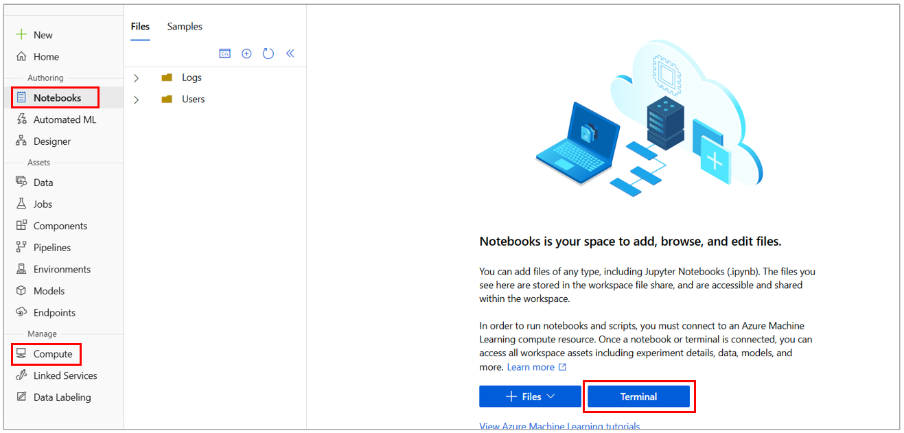

## Cloning GitHub repo

After you complete the "Deploy to Azure" workflow, 
you will be able to access your newly created Azure ML workspace and studio in the Azure portal.

When your deployment is complete, you will see a message similar to the one shown here. 
Click on the "Go to resource group" button to find you Azure ML resource. 

You will then see a list of the resources in the resource group. 
Click on the Azure ML workspace item. 

At the next sceen, you will see the option to launch your Azure ML studio. 
Click on the "Launch studio" button. 

You will now arrive at the Azure ML studio homepage. 
Click on the "Notebooks" items to open the workspace. 
You can check that your compute resource is running by clicking on the "Compute" item, 
located on the lower left of the screen, under the "Manage" header. 
Otherwise, open a terminal window directly by clicking the "Terminal" button.

Once you have the terminal open, navigate to the directory you want to be the root directory of this project. 
Then clone the repo using hte following command. 

`git clone https://github.com/microsoft/ResponsibleAIAccelerator`

Thats it. Now you can return to the main [read me](../readme.md/) 
to continue learning about the Responsible AI dashboard. 

